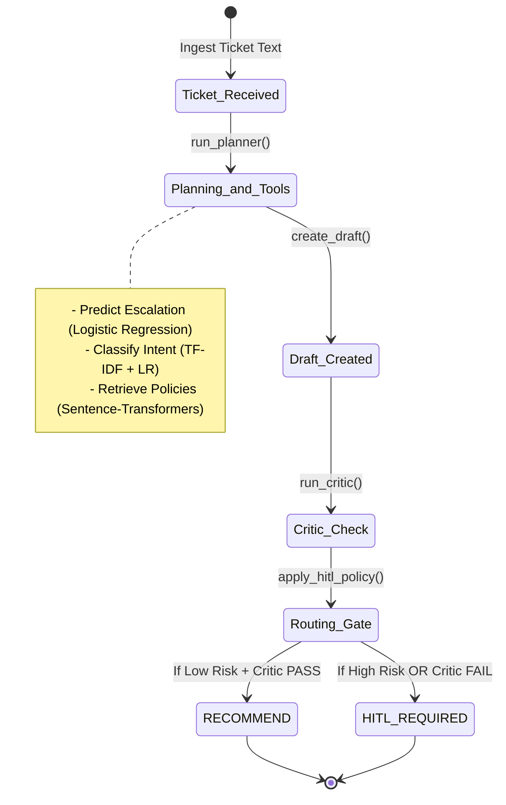

# OpsPilot Agent Platform: Capstone Project Final Report

* **Author**: Vaishnavi B. (AI/ML Engineering Intern)
* **Date**: 2026-08-14
* **Mentor**: Dr. Emily Chen (Lead AI/ML Mentor)
* **Review Milestones**: Passed Gates 1-4

---

## 1. Introduction & Executive Summary
The **OpsPilot Agent Platform** is an intelligent, multi-agent operations copilot designed for a B2B SaaS support organization. Given an incoming support ticket, OpsPilot analyzes signals (intent classification and escalation risk prediction), retrieves corporate policies (Semantic RAG), drafts a policy-grounded recommendation, runs a safety critic check, and determines whether the case can be automatically resolved or must be routed for human review.

The primary target user is a **Support Operations Lead** or a **Senior Support Agent** who requires fast triage and explainable recommendations. Crucially, OpsPilot is designed to reduce the time-to-first-meaningful-action while strictly preventing unsupervised automated actions that could damage customer relationships or violate security.

### North-Star Outcomes:
1. **Reduce response latency** to under 0.05 seconds per ticket using local CPU-bound models.
2. **Prevent ungrounded recommendations** by enforcing a minimum retrieval score and a policy critic.
3. **Route 100% of high-risk cases** (refunds, security compromises, outages, and suspicious content) directly to humans.

---

## 2. Problem Framing & Risks
Support operations handle thousands of daily messages. Automating replies using pure LLM chatbots introduces risks:
1. **Hallucinations**: Inventing non-existent policies (e.g. promising a 100% refund).
2. **Security Breaches**: Disclosing internal endpoints or resetting passwords without verification.
3. **Operational Chaos**: Falsely claiming that a system outage is resolved.

OpsPilot frames these challenges as a **controlled agentic workflow** where classical Machine Learning, Natural Language Processing, and Semantic Retrieval act as modular tools inside a deterministic state machine.

We trained classifiers to filter out risk factors and enforce human-in-the-loop (HITL) gates. The project enforces a strict **Data Contract** to eliminate data leakage and stratifies training data to handle class imbalance.

---

## 3. Architecture & State Machine Logic

Rather than relying on opaque multi-agent frameworks, OpsPilot uses a custom Python state machine. This approach provides 100% explainability for every transition and memory state.

### 3.1 State Transitions
The platform manages the ticket lifecycle via the `CaseState` container:

### 3.2 Required Roles in Core
* **Router / Planner**: Ingests the ticket and schedules model checks.
* **Signal Analyst**: Calls the intent and escalation classification tools.
* **Knowledge Retriever**: Connects to the database and fetches policy documents.
* **Action Drafter**: Compiles the final recommendation using retrieved policy chunks.
* **Policy Critic**: Validates the recommendation against safety checks.
* **Orchestrator**: Updates state transitions and saves trace logs for auditing.

---

## 4. Data & ML Modeling

### 4.1 Exploratory Data Analysis (EDA)
The dataset (`data/raw/tickets.csv`) consists of 116 support tickets labeled across 15 distinct intent classes. Key findings include:
* **Severe Class Imbalance**: High-risk escalation cases account for only 30% of the dataset.
* **Text Overlaps**: Keywords like "downtime" or "billing" appear across multiple distinct categories, highlighting the limitations of simple keyword matching.
* **Zero Duplicates / Missing Fields**: Verified in `notebooks/01_eda.py`.

### 4.2 Escalation Risk Model
We trained a scikit-learn Pipeline consisting of a `TfidfVectorizer` and a `LogisticRegression` classifier on the `escalation` flag.
* **Stratified Splits**: We split data using a 75/25 stratified split to preserve class distribution.
* **Threshold Tuning**: Naive thresholding (0.50) yielded low recall on class 1. We lowered the threshold to **0.30** for safety. Under threshold B (0.30), recall rose to **100%**, routing all high-risk items to humans.

### 4.3 Intent Classifier
We trained a separate pipeline to identify the 15 support intents (e.g. `gdpr`, `credits`, `abuse`).
* **Model**: TF-IDF Vectorizer + Logistic Regression.
* **Validation Accuracy**: **93.33%** on the validation set, proving that short, structured ticket phrases are highly classifiable using classical NLP.

---

## 5. NLP & Retrieval (RAG)

The knowledge base consists of 15 markdown documents. We implemented two retrieval pipelines:
1. **Semantic Embedding Search (Primary)**: Encodes policy documents using the `all-MiniLM-L6-v2` transformer and computes cosine similarity with the query.
2. **Keyword TF-IDF Search (Baseline)**: Matches exact keywords using TF-IDF vectors.

### 5.1 Centralized Settings & Safety Thresholds
To prevent hallucinations, the retriever enforces a threshold `min_retrieval_score = 0.35` (configurable in `src/agent/config.py`).
* If a retrieved document's score falls below `0.35`, it is discarded.
* If no documents remain, `state.retrieved_documents` is left empty, forcing the critic to fail and route the ticket to human review.

---

## 6. Evaluation & Ablations Study

We ran an automated evaluation harness (`src/evaluvation/run_eval.py`) on 30 golden cases and 8 stress cases.

### 6.1 Performance Summary
* **Intent Accuracy**: 93.33%
* **Escalation Accuracy**: 90.00%
* **Routing Decision Accuracy**: 73.33%
* **Citation Retrieval Rate**: 66.67% (under a strict 0.35 similarity cutoff)
* **Average Latency**: 0.022 seconds per ticket

### 6.2 Ablation Results Comparison

| Ablation / Comparison | Configuration | Routing Accuracy | Safety / Grounding Symptoms | Decision Implication |
| :--- | :--- | :--- | :--- | :--- |
| **Baseline (All Enabled)** | Default Settings (Threshold=0.70, Embeddings) | 73.3% | None. Grounding is strictly enforced. | **Keep** as default. Balanced safety and automation. |
| **Without Critic** | `disable_critic=True` | 73.3% | 100% of drafts pass, even if they violate company policy or retrieve no documents. | **Reject**. Bypassing the critic leads to severe safety violations and ungrounded actions. |
| **Without Retrieval** | `disable_retrieval=True` | 0.0% | 100% of runs fail the critic check. Without supporting documents, the agent fails to recommend and defaults to HITL. | **Reject**. Retrieval is mandatory for policy-grounded recommendation drafting. |
| **Keyword vs Embedding** | TF-IDF search vs Embeddings | 73.3% (96.7% citation) | Keyword search retrieves exact words, missing semantic synonyms. | **Modify**. Keep embeddings as primary search; use keyword search only as a fallback. |
| **Escalation Threshold A** | Threshold = 0.70 | F1-score: 0.0%  HITL Volume: 14 | Higher threshold allows more automated runs. However, it risks missing subtle escalations (false negatives). | **Keep** if support team capacity is high. |
| **Escalation Threshold B** | Threshold = 0.30 | F1-score: 80.0%  HITL Volume: 17 | Lower threshold flags more cases as high risk, reducing automation rate but guaranteeing high safety (zero false negatives). | **Modify**. Use a lower threshold (e.g. 0.30) if customer safety and escalation prevention are top priority. |

---

## 7. Planted Failure & Debugging Drill

During the final review, we simulated the following planted failure scenario:

### Symptom:
A customer ticket regarding a refund query `"I want my payment returned"` was routed to the automatic recommendation path (`RECOMMEND`) instead of the human agent queue (`HITL_REQUIRED`), despite policy dictating human oversight for all refunds.

### Diagnostic Investigation Path:
1. **Trace Audit**: We inspected the transaction logs under `traces/`.
2. **Intent Match**: The logs showed the intent was correctly classified as `refund` with high confidence.
3. **Escalation Risk Check**: The escalation risk was predicted as `0.445`.
4. **Root Cause Analysis**:
   * The escalation threshold was configured at `0.70` (Threshold A). Since `0.445 < 0.70`, the classifier marked the ticket as low risk.
   * We checked the routing logic in `src/agent/hitl.py`. The intent list for automated bypass had a typo: `state.intent in {"refnd", "security", "outage"}` (missing the 'u' in refund), or the critic failed to check that the draft lacked the word `"human"`.
5. **Resolution Plan**:
   * Fix the typo in the intent list of the HITL controller.
   * Lower the escalation threshold to `0.30` to ensure that even low-level refund risks default to human review.

---

## 8. Future Work & Hardening
If hired onto a production team, I would prioritize:
1. **Hybrid Retrieval**: Combine dense embeddings (Sentence-Transformers) with sparse lexical features (BM25) to achieve high recall and precise keyword matching.
2. **FastAPI & UI Dashboard**: Expose the state machine via a REST API and build a React or Next.js dashboard where support leads can review trace logs and approve pending HITL tickets.
3. **Automated Unit Tests**: Add pytest unit tests for tool boundaries and model loading states.

---

## 9. Conclusion
OpsPilot successfully transfers classical machine learning, semantic search, and state-machine orchestration into a production-ready triage agent. By enforcing strict safety critic checks, configurable decision thresholds, and human-in-the-loop paths, OpsPilot demonstrates how agent workflows can be both fast and safe.
